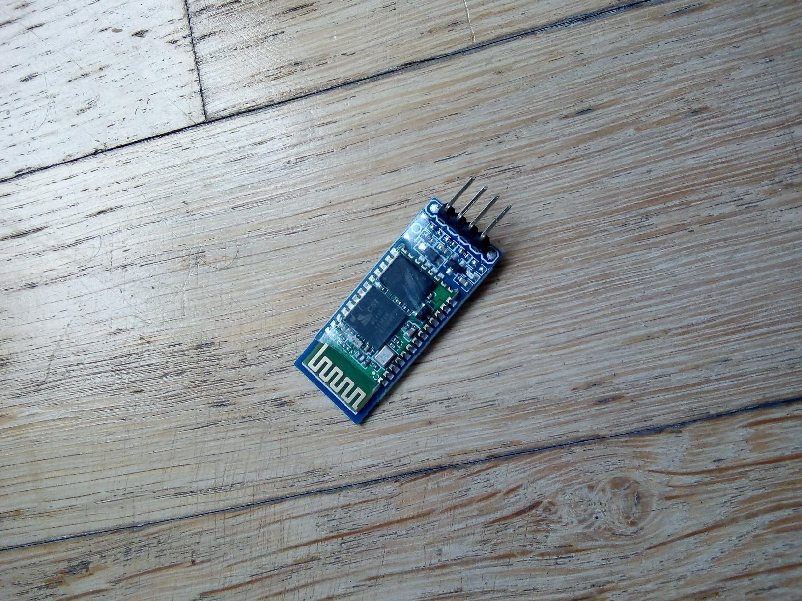

# NFC_BT_COM

**NFC_BT_COM** is a system for controlling a servo via a mobile application. The system consists of an application on the phone and an STM32F407c board. The project was created as part of the subject "Projekt Zespołowy" in the second semester of 2022/23.

**Status** - Project completed by only one person because a second team member withdrew from work

## Table of contents

* Author
* Technologies
* General info
* Android application
* STM32F4 and moduls

## Author
[Marek Frańczak](https://github.com/marekfranczak)

## Technologies and Hardware
* Kotlin 1.6.0 [Android application development language](https://kotlinlang.org/)
* C language [STM32 microcontrollers programming language](https://en.wikipedia.org/wiki/C_(programming_language))
* Bluetooth 2.0 [Short-range wireless technology standard](https://en.wikipedia.org/wiki/Bluetooth)
* STM32CubeIDE 1.9.0 [STM32 microcontroller programming environment](https://www.st.com/en/development-tools/stm32cubeide.html)
* IntelliJ IDEA 2021.3.2 [Android application programming environment](https://www.jetbrains.com/idea/)
* STM32 F401c [STMF32 F401c microcontroller](https://kamami.pl/wycofane-z-oferty/207977-stm32f401c-disco.html)
* HC-06 Bluetooth module [Bluetooth module](https://botland.com.pl/moduly-bluetooth/6818-modul-bluetooth-hc-06-zs-040-5904422375300.html)
* Micro Servo SG90 -9g [MicroSerco](https://botland.com.pl/serwa-typu-micro/1242-serwo-towerpro-sg-92r-micro-2000000013503.html)

## General info
The application on the phone with the android system (8.0+) is connected via bluetooth with the HC-06 module. Information sent to the bluetooth module contains 3 bytes. The module transmits commands to the microcontroller, which forces the servo to operate. STM32F4 microcontroller communicates with the bluetooth module using the UART port. After sending the information, hc-06 goes into the listening state. The microcontroller places the obtained value into the ARR(AutoReload Register). The ratio of the current value in the register to the maximum value corresponds to the duty cycle of the PWM signal generated on one of the STM32F4 pins. In response to the PWM signal, the servo rotates through the given angle.

## Android application
The application gets a list of paired bluetooth devices from android.The hc-06 module is paired with the phone outside the application. After connecting to the application, the user gets a window that allows to control the servo mechanism and the possibility of disconnecting HC-06 and application. The values that can be set are in the range of 0-180 degrees. Before sending, the application converts the value of the angle so that it corresponds to the fulfillment of the ARR register in the microcontroller. The information sent contains three bytes.

## STM32F4 and moduls
**STM32F407c**
The microcontroller is powered by 5v using usb. It communicates with the motor using the PWM signal, while the bluetooth module uses UART. The PWM signal is on pin pa10. A timer is connected to this pin, which is directly responsible for interrupt on the pin. The interrupt frequency corresponds to the period of the PWM signal that the servo receives. The interrupt frequency can be calculated from the formula: 
INT_FREQ = TIM_CLK/(ARR+1)(PSC+1)(CKD+1)
where
INT_FREQ - frequency of the generated interrupt
TIM_CLK - clock frequency of the bus on which the timer is located
ARR (AutoReload Register) - the value to which the timer counts
PSC, CKD - irrelevant system registers
The values selected in the project are:
INT_FREQ = <667-1000>Hz
TIM_CLK = 100000000 Hz
PSC = 999
CKD = 0
Max. value ARR = 1000
The value of ARR will change depending on the value we pass to the CCR variable in the main.c function.
Changing the value in the ARR register changes the frequency of the PWM signal.

**HC-06**
Bluetooth module that communicates with the phone using a baud of 9600 bit/s. Rx line of the module is connected to pb6 pin tx line to pb7 pin. HC-06 is supplied with 3V.
 

**MicroServo SG90 -9g**
Micro is supplied with 5V. Can be rotated by 180 degrees. PWM signal with a period of 1 ms corresponds to a rotation of 90 degrees to the left, 1.5 ms corresponds to the middle position and 2 ms corresponds to a rotation of 90 degrees to the right. Torque of servo is 2.5kg/cm.

## License
For open source projects, say how it is licensed.
